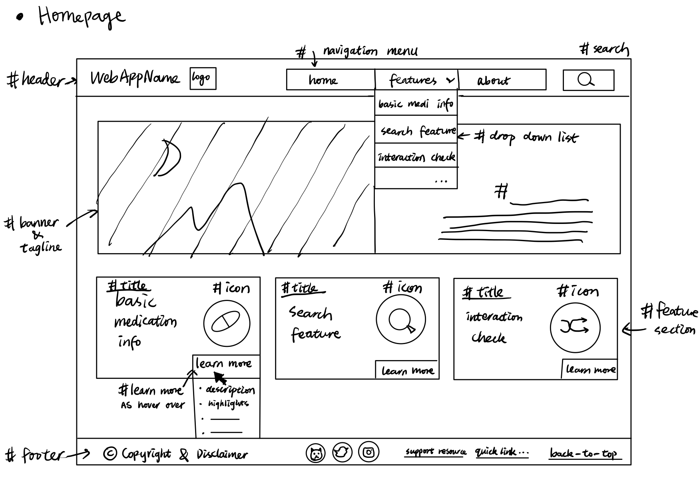
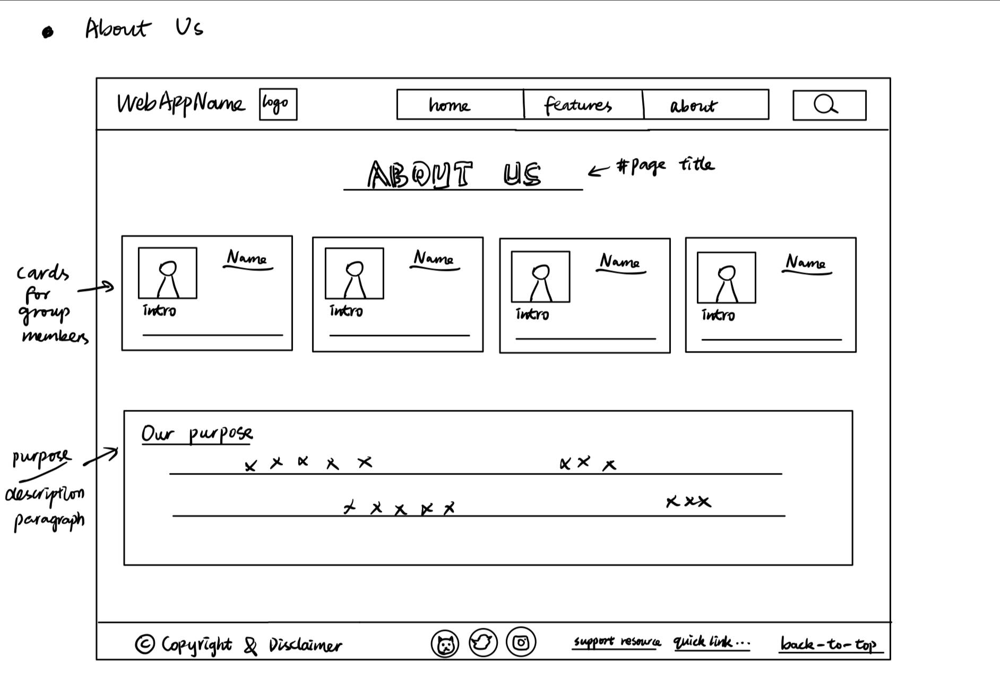
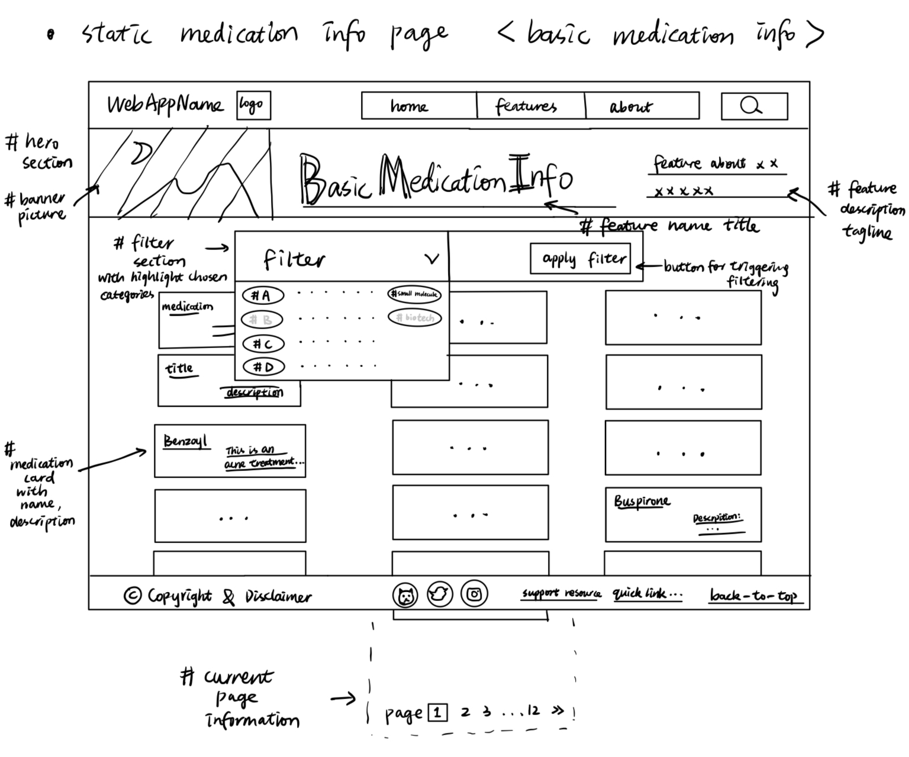
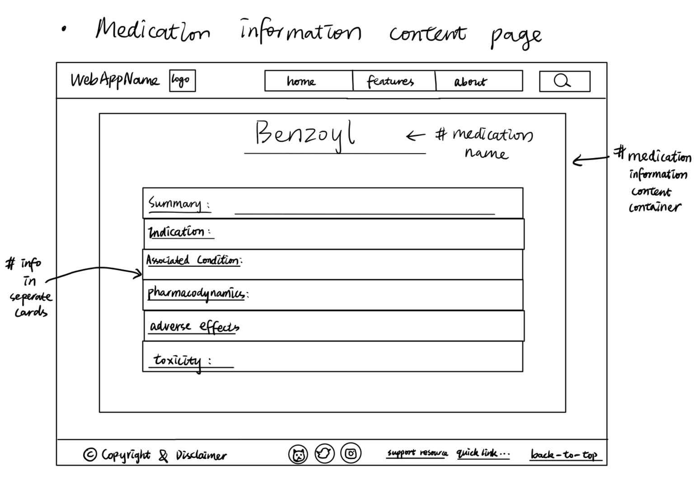
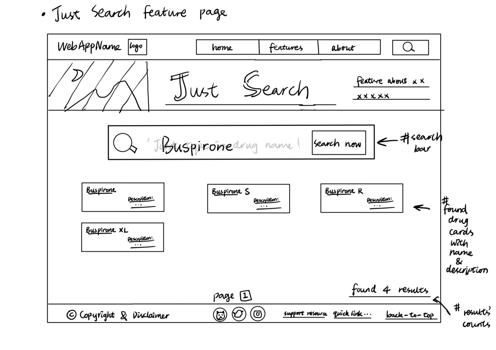
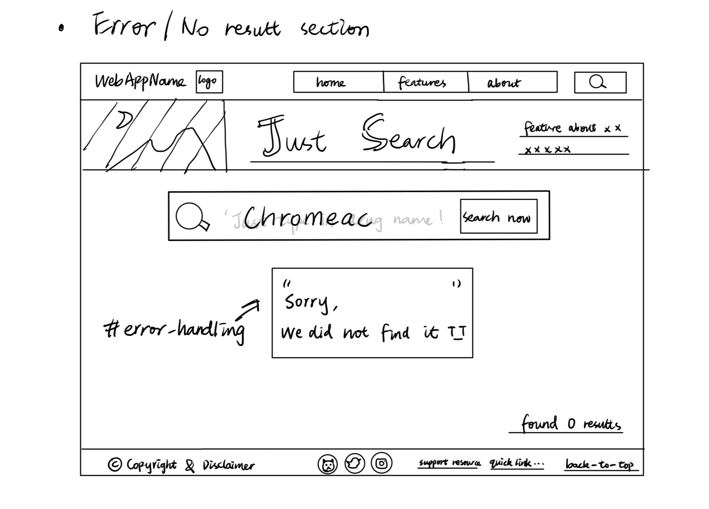
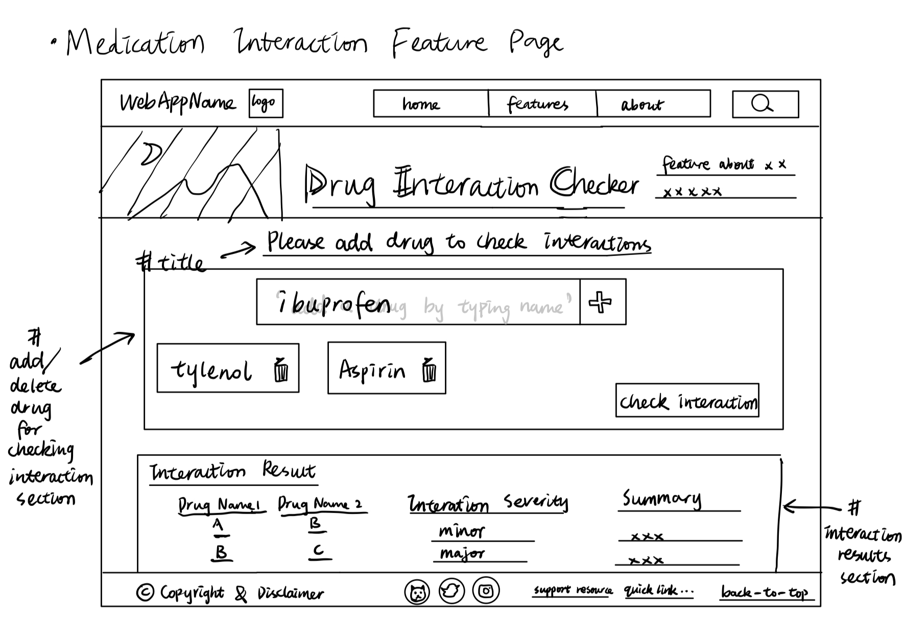

# F-Team Fit As A Fiddle

## Team Members  
| Member Name | Role | 
| :---       |    :---:   |
| Erica Gordy | Project Manager |
| Haonan Zheng | Product Designer |
| Elora Hoberecht | Developer |
| Lily Dong | Developer |  

# Problem
Research from the American Medical Association and the National Institute of Health has found that patients with chronic diseases in the US fail to take their medications as directed about 40-50% of the time ([American Medical Association [AMA], 2023](https://www.ama-assn.org/delivering-care/patient-support-advocacy/8-reasons-patients-dont-take-their-medications#:~:text=Medication%20nonadherence%E2%80%94when%20patients%20don,for%20patients%20with%20chronic%20disease.); [Lee et al., 2006](https://jamanetwork.com/journals/jama/article-abstract/204402); [Kleinsinger, F., 2018](https://www.ncbi.nlm.nih.gov/pmc/articles/PMC6045499/)). The primary causes of this include excessive cost, misunderstanding of the purpose of the medication(s), fear of side effects or medication dependence, and confusion/difficulty managing dosing schedules for multiple medications. Medication nonadherence contributes to roughly 125,000 preventable deaths in the US and places an economic burden of $100 billion to $300 billion dollars on the healthcare system ([Cutler et al., 2018](https://pubmed.ncbi.nlm.nih.gov/29358417/); [Kleinsinger, F., 2018](https://www.ncbi.nlm.nih.gov/pmc/articles/PMC6045499/)). The individual consequences of noncompliance include disease progression, lower quality of life, and increased reliance on medical institutions including hospital visits and admission, nursing homes, and reliance on other medical resources. Medication nonadherence contributes to at least 125,000 preventable deaths annually ([Benjamin, 2012](https://www.ncbi.nlm.nih.gov/pmc/articles/PMC3234383/)). Currently, there are existing pharmacy programs aimed at helping Medicare patients stay on track with their medications, in which a pharmacist checks patients’ prescription history and calls the patient to discuss adherence barriers. However, these programs do not help non-elderly patients– there has been a push in recent years for providers to communicate openly with their patients about the medications they prescribe, but overwhelmed physicians may not have time to fully discuss the details of these medications with patients. How might we develop a tool to help chronic disease patients make better informed decisions about their medications and improve medical literacy?

# Solution Summary
Our product aims to solve the issue of misinformation and miscommunication surrounding prescription medications. We will have a web page that allows users to search for their medications and receive information about the drug formulas, usages, potential interactions, allergy information, and much more. We will be using an API called DrugBank (for academic research) that contains all the information about medications we might want to display to the user. The user will also be able to filter medications based on a specific category or drug class and various other filterable options. The third feature we are going to implement is to check and inform users of potential interactions between their medications. This will prevent potential harm due to a lack of knowledge of the drug interactions. If time allows, we will also implement a feature where users can create an account and register their medications to receive push notifications. We will manage notifications using Twilio. 

# Design 
## Homepage

Header: display website name, logo; navigation menu; login/sign up; search bar (display them in order from left to right)  

Hero Section: display the banner picture; tagline for illustrating website purpose;  

Features Section:  
&ensp;&ensp;1. display the website features in card with titles, icons  
&ensp;&ensp;	- basic medication info feature (#medi101)  
&ensp;&ensp;	- search feature (just search)  
&ensp;&ensp;	- interaction check feature (potential interaction between drugs checking)  
&ensp;&ensp;2. direct to the feature page after clicking the corresponding feature card  
&ensp;&ensp;3. have ‘...’ or ‘learn more’ button on right bottom corner of the card  
&ensp;&ensp;4. show the drop-down cards, displaying feature descriptions, highlights  in bullet points, once click on ‘...’ and/
&ensp;&ensp;    or ‘learn more’ button  

Footer: display the information about copyrights and disclaimer; display the social media links or icons; displays the quick links for support resources; have a back-to-top button  

## Navigation 
Display three clickable parts in navigation bar: 1. home, 2. features, 3. about (display them in order from left to right)  

&ensp;&ensp;- Once click the ‘home’ button, redirect user to the home page  
&ensp;&ensp;- provide the drop down menu as user click or hover over ‘features’ button, including the clickable buttons for   
&ensp;&ensp; each feature which enables users to be redirected to the clicked feature pages  
&ensp;&ensp;- have the about button, directing users to the ‘about us’ page as being clicked  

## About Us Page  

Keep the header and footer sections; show page title as ‘about us’; display the content container about our group members with pictures (optional) and short introductions; have another container to show our purpose in a short paragraph.  

## Static Medication Information Page

Redirect to this page once user click (basic medication info) feature button in feature section on the homepage or feature button in the navigation menu  

Header & Footer: keep  

Hero Section: banner picture + feature title + tagline for one short paragraph intro for this feature  

Filter section: have one drop-down list for asking users’ preferences in making filters and  applying filters  
&ensp;&ensp;Details:  
&ensp;&ensp;- 'filter' button will be set on the left top, 'apply filter' button will be set on the right 
bottom corner of the filter section  
&ensp;&ensp;- As hover over or click on the 'filter', a drop-down list have categories from A to Z, category, small molecule 
&ensp;&ensp;drugs, and biotech drugs (29 categories available)  
&ensp;&ensp;- Categories are clickable, and the ones (one or multiple) that are chosen by users will be  highlighted, and being 
&ensp;&ensp;applied as user click 'apply filter'  
Medication title and description card’s grid section:  
&ensp;&ensp;Details:  
&ensp;&ensp;Card: have the medication title and description on the card (title with bold font weight, description under the title, in light font weight)  
&ensp;&ensp;Layout: 3x5  
&ensp;&ensp;- Have current page information in the bottom, above footer section  

## Medication Information Content Page  

(redirect to this page once user click medication title or card):  
&ensp;&ensp;- keep header and footer  
&ensp;&ensp;- fill the content container in the middle of the page with: medication title, summary, indication, associated conditions, pharmacodynamics, adverse effects, toxicity (from top to bottom) in the separate wide-flatten cards  

## Search Feature   

(redirect to this page once user click 'Just search' feature button in feature section on the homepage, feature button in the navigation menu, or search icon in the header)  

Header & Footer: keep  

Hero Section: banner picture + feature title + tagline for one short paragraph intro for this feature  

Search bar section:  
&ensp;&ensp;have a large search bar, with layout of: 'search icon', text of ‘just type in the medication name!’, highlighted 'search now' button for triggering the search  
Medication title and description card’s grid section:  
&ensp;&ensp;(display this section under 'Search bar section' once user triggers the search):  
&ensp;&ensp;Details:  
&ensp;&ensp;Card: have the medication title and description on the card (title with bold font weight, description under the title, in light font weight)  
&ensp;&ensp;- Show the number of results found in the right bottom corner of the page  
&ensp;&ensp;Layout: 3x5  
&ensp;&ensp;- Have current page information in the bottom, above footer section  

Medication information content page:  
(redirect to this page once user click medication title or card):
&ensp;&ensp;Details:  
&ensp;&ensp;- keep header and footer  
&ensp;&ensp;fill the content container in the middle of the page with: medication title, summary, indication, associated conditions, pharmacodynamics, adverse effects, toxicity (from top to bottom) in the separate wide-flatten cards  

Error/No result section:  
(display this section under the 'Search bar section' if the medication name is not found
from our database):  
&ensp;&ensp; Details: have a line of text: ‘Sorry, we did not find this. T_T’  
&ensp;&ensp;- Show the number of results found in the right bottom corner of the page  

## Medication Interaction Feature  

(redirect to this page once user click 'Interaction checker' feature button in feature section on the homepage or feature button in the navigation menu)  

Header & Footer: keep  

Hero Section: banner picture + feature title + tagline for one short paragraph intro for this feature  

Add Drug for interaction checking section:  
&ensp;&ensp;Details:  
&ensp;&ensp;-Have ‘Please add drug to check for interaction’ as the title  
&ensp;&ensp;-Have the search bar, with the add icon and text ‘add a drug by typing name’  
&ensp;&ensp;-Display the chosen drugs in simple cards under search bars  
&ensp;&ensp;-Have delete icons for each chosen drug  
&ensp;&ensp;-Have a 'check interaction' button on the right bottom corner of this section  

&ensp;&ensp;Algorithmic functionality:  
&ensp;&ensp;Once users type in the name of a single drug that they want to check, the drug name will be displayed in the bottom space.  
&ensp;&ensp;Once users finish adding all drug names that they are looking for to make an interaction check, they can click the &ensp;&ensp;'check interaction' button to submit the drug interaction search, then the interaction result will be shown in the &ensp;&ensp;following 'interaction result' section.  

Interaction Result section:  
(display the interaction result information once user click 'check interaction' button)  
&ensp;&ensp;Details:  
&ensp;&ensp;- Display A and B drugs’ name, their interaction severity, and description of interaction (arrange from left to right)  

&ensp;&ensp;Algorithmic functionality:  
&ensp;&ensp;If users add 2 more drugs for interaction checking, there should be more than one 'interaction result' cards being displayed: e.g. A&B, C&B, A&C.  
&ensp;&ensp;- Only the drugs that have interaction between them will have 'interaction result' card and be displayed.
&ensp;&ensp;- Severity is scaled from major, moderate, to minor.  

# Stretch Goals  
## Notification Feature  
(redirect to this page once user click 'Notification' feature button in feature section on the homepage or feature button in the navigation menu)  

Header & Header: keep  

Hero Section: banner picture + feature title + tagline for one short paragraph intro for this feature  

Notification setup section:  
&ensp;&ensp;Details: have four subsections for users to personalize with their inputs (text type in, time
picker, and radio buttons); have the 'add notification' button to submit users’ input  

&ensp;&ensp;Algorithmic functionality:  
&ensp;&ensp;1. once user fills all the subsections and click the 'add notification', the notification title should be added to the list under 'My notification' section  
&ensp;&ensp;2. once user chooses email/phone/both, the notification should be sent to the corresponding contact methods that are shown on the current 'contact method' section  
&ensp;&ensp;3. If user did not fill all the required fields, pop up one alert box: showing the text about ‘all fields are required, please fill them out’  

'My notification' section:
&ensp;&ensp;Details: shows all submitted notifications by their titles, have a 'delete' button for user to delete the specified notification  

'Contact method' section:  
&ensp;&ensp;Details: display users’ email addresses and phone numbers as they sign in, have the button 'edit' for users to edit their contact information.  

Contact method 'edit' pop up section:  
&ensp;&ensp;Details: pop up corresponding section (email or phone) once user click edit button, have ‘edit email address’ and ‘edit phone address’ as titles.  
&ensp;&ensp;- Have the entry space for users to update their new information  
&ensp;&ensp;- Have ‘submit’ button to submit the edit  

## Login/Sign In Page  
&ensp;&ensp;1. Pop up a content container in the middle of the page, keeping the header and footer sections.
&ensp;&ensp;Details: in this popped-up container, have ‘Account’ as the title in the top-middle section, then have two clickable buttons 'sign in', 'create account'  
&ensp;&ensp;2. once user click the 'sign in' button, cover the previous container with a new one as the ‘Sign in’ page  
&ensp;&ensp;Details: in the same-sized container, have the ‘sign in’ as the title in the top-middle, then have two empty entry spaces: the upper one asking for mobile number or email address, the lower one asking for the password; have the clickable ‘sign in’ button in the bottom part.  
&ensp;&ensp;3. once user click the 'create account' button, cover the container in step1. with a new one as the ‘create account’ page  
&ensp;&ensp;Details: have the ‘create account’ as the title, then have five empty entry spaces asking:  
a. Email, b. First Name, c. Last Name, d. mobile number (optional), e. password; once users enter their information in the spaces, 'create account' button can be clicked now.  